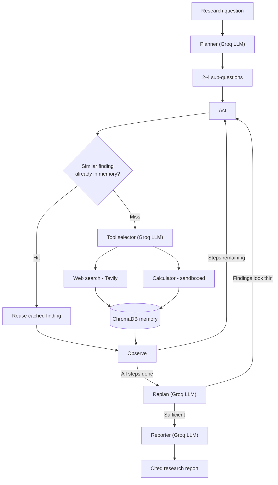
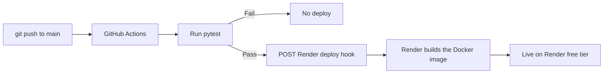

# Autonomous Research Agent


A small "deep research" agent: give it a question, and it plans a multi-step
research strategy, calls tools (web search, a sandboxed calculator) in a
loop, re-plans when results look thin instead of giving up, remembers what
it's already found so it doesn't repeat searches, and produces a structured
report that cites which finding came from which source — streamed live over
SSE as it reasons, not returned as one final blob.

This is deliberately not a single-shot chatbot wrapper: the interesting part
is the plan → act → observe → re-plan loop and the engineering around making
that loop reliable, not the LLM call itself.

**Live**: https://autonomous-research-agent-ln8a.onrender.com — free-tier
Render instance, so the first request after a few minutes of inactivity can
take 30–50s to wake up. `/docs` gives you an interactive API page; `/health`
is a plain liveness check.


## What it does

- **Plans**: breaks a research question into 2–4 concrete sub-questions via an LLM call, not a hardcoded template.
- **Acts**: for each sub-question, an LLM picks web search or a calculator and produces the exact query/expression, then the tool actually runs.
- **Remembers**: every finding is embedded and stored in ChromaDB; before running a new search, the agent checks memory first and skips the tool call entirely on a near-duplicate question.
- **Re-plans**: once the current sub-questions are answered, another LLM call decides whether the findings actually answer the original question or whether more angles are needed — capped so the loop can't run away.
- **Cites**: the final report is generated with deterministic, code-assigned citation numbers (not left to the LLM to get right), with a References section mapping each number back to its source.
- **Streams**: every planning step, tool call, and finding is pushed to the client the moment it happens over Server-Sent Events, so the reasoning is visible live.

## Architecture



The loop is a LangGraph `StateGraph`; the FastAPI layer streams it via
`stream_mode="updates"`, turning each node's completion into one SSE event
(`plan`, `tool_call`, `finding`, `report`) instead of the client waiting
for the whole run.



Render's own auto-deploy-on-push is deliberately turned off
(`autoDeploy: false` in `render.yaml`); the GitHub Actions workflow is the
only thing that can trigger a deploy, and only after tests pass.

## Tech stack

| Layer | Choice |
|---|---|
| Language | Python 3.11 |
| Orchestration | LangGraph |
| LLM | Groq (`openai/gpt-oss-120b`) |
| Web search | Tavily |
| Memory | ChromaDB (local embedding function, no extra API/key) |
| API | FastAPI, Server-Sent Events |
| Container | Docker |
| Hosting | Render (free tier) |
| CI/CD | GitHub Actions → Render deploy hook |

## A few engineering decisions worth knowing about

- **Citation numbers are assigned in code, not by the LLM.** The model gets findings pre-tagged with `[n]` markers and only writes prose around them; the References section is built directly from the same source list. See [`report.py`](src/agent/report.py).
- **Memory is scoped per research run (`run_id`), not global.** A semantically-similar finding from a *different* past topic would produce a wrong citation, which matters more here than the extra cache hits a shared store would give. See [`memory.py`](src/agent/memory.py).
- **Tool selection degrades gracefully.** If the LLM call that picks a tool fails outright (this happens — see the commit history for a real case where a reasoning model burned its whole token budget on hidden reasoning and returned nothing), it falls back to a plain web search instead of crashing the run.
- **Prompt content is sized to Groq's free-tier rate limit**, not just "however long the search results are" — found this the hard way when full-length search content blew an 8,000-token-per-minute cap.
- **The embedding model is baked into the Docker image at build time**, not downloaded on first use — Render's free tier spins the container down when idle, so without this every wake-up would stall a live request on an ~80MB download.

## Getting started locally

Requires Python 3.11+. If your system default is older (check `python3 --version`):

```bash
brew install python@3.11
```

Clone and set up:

```bash
git clone https://github.com/meetpatil1110/autonomous-research-agent.git
cd autonomous-research-agent
python3.11 -m venv .venv
source .venv/bin/activate
pip install -e ".[dev]"
```

Copy the env template and fill in your keys:

```bash
cp .env.example .env
```

- `GROQ_API_KEY` — free at [console.groq.com](https://console.groq.com)
- `TAVILY_API_KEY` — free at [tavily.com](https://tavily.com) (1,000 searches/month)
- `GROQ_MODEL` — defaults to `openai/gpt-oss-120b`; if you get a `model_not_found` error, check [console.groq.com/docs/models](https://console.groq.com/docs/models) for what's currently available on your account

Run it from the CLI:

```bash
PYTHONPATH=src python scripts/run_agent.py "What is the current state of nuclear fusion energy commercialization?"
```

Or run the API server locally:

```bash
PYTHONPATH=src uvicorn api.main:app --reload --port 8000
```

Then in another terminal:

```bash
curl -N -X POST http://127.0.0.1:8000/research \
  -H "Content-Type: application/json" \
  -d '{"question": "What is the boiling point of water at sea level in Celsius?"}'
```

`-N` disables curl's output buffering so you see events as they stream in,
rather than all at once at the end.

## Testing

```bash
pytest -q
```

All 46 tests run without needing real API keys or network access — LLM
calls are injected/mocked, except for the ChromaDB memory tests, which
exercise real local embeddings (no API key needed, downloads a small model
on first run) to actually verify the semantic matching works rather than
just asserting a mock was called.

## Running with Docker

```bash
docker build -t autonomous-research-agent .
docker run --rm -p 8000:8000 --env-file .env autonomous-research-agent
```

## Project structure

```
src/
  agent/          # LangGraph loop, tools, memory, planning/report prompts
    tools/        # web_search (Tavily) and the sandboxed calculator
  api/            # FastAPI app + SSE streaming layer
scripts/
  run_agent.py    # CLI entrypoint for local runs
docker/
  fetch_embedding_model.py  # pre-fetches the embedding model at build time
tests/
Dockerfile
render.yaml       # Render Blueprint (env vars, health check, autoDeploy: false)
.github/workflows/deploy.yml  # CI-gated deploy
```

## License

MIT — see [LICENSE](LICENSE).
